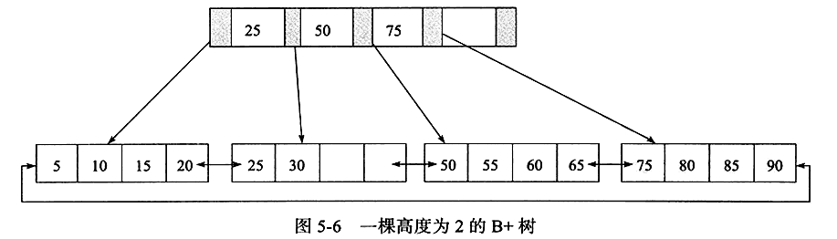
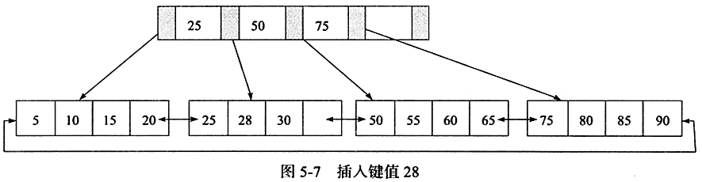
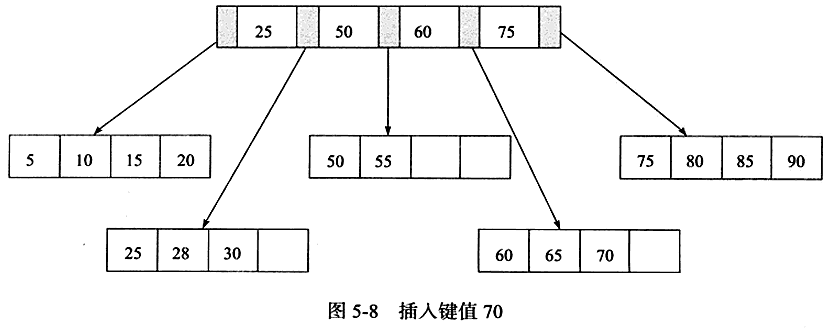
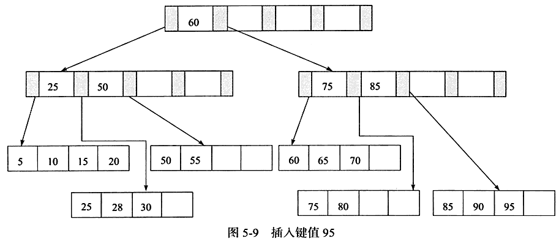
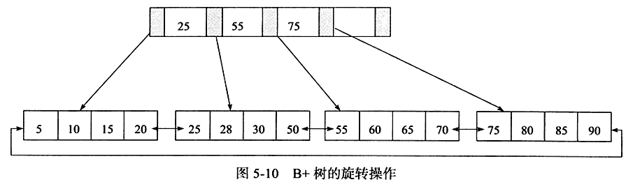
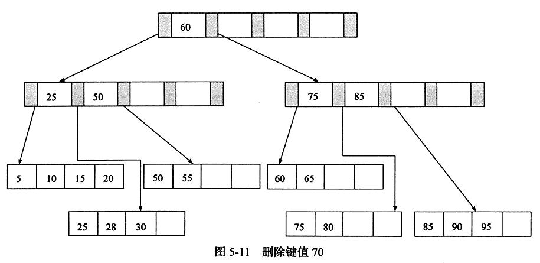
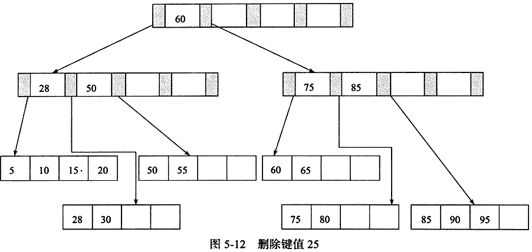
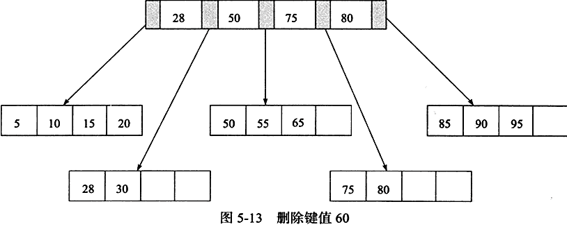

# B+ 树

* B+ 树是 1970 年 `Rudolf Bayer` 教授在 `《Organization and Maintenance of Large Ordered Indices》` 一文中提出的一种树数据结构。它采用多叉树结构，降低了索引结构的深度，避免传统二叉树结构中绝大部分的随机访问操作，从而有效减少了磁盘磁头的寻道次数，降低了外存访问延迟对性能的影响。同时它保证树节点中键值对的有序性，从而控制 search、insert、delete、update 操作的时间复杂度在 `O(log(n))` 范围内。鉴于上述优势，B+ 树常作为索引结构的构建模块，被广泛应用在大量数据库系统和文件存储系统中。
* **注意**：B+ 树中的 B 不代表二叉 binary，而是代表平衡 balance，因为 B+ 树是从最早的平衡二叉树演变而来的，但是 B+ 树不是一个二叉树。

## B+ 树的特征

1. **在 B+ 树中的节点通常被表示为一组有序的元素和子指针。**

2. **如果此 B+ 树的阶数是 m，则除了根之外的每个节点都包含最少 m/2（向下取整） 个元素最多 m-1 个元素，对于任意的结点有最多 m 个子指针。**

3. **所有叶子都在相同的高度上，叶节点本身按关键字大小从小到大链接。**

4. **所有的数据信息都存储在叶节点上，非叶节点仅作为叶节点的索引存在。**

   

## 查找

* **顺序查找**

  通常在 B+ 树上有两个头指针，一个指向根节点，另一个指向关键字最小的叶子节点。因此可以从叶子结点顺序链表的头指针开始，顺序去查找目标值。

* **随机查找**

  起始于根节点，自顶向下遍历 B+ 树，选择其分离值在要查找值的任意一边的子指针，在节点内部使用二分查找来确定位置。如果在查找时，若非叶子节点上的关键字等于目标值，此时并不会终止，而是继续向下直到叶子节点。因此在 B+ 树中，不管查找成功与否，**每次查找都是走了一条从根节点到叶子节点的路径**。

## 插入

B+ 树的插入必须保证插入后叶子节点的记录依然有序，同时要考虑插入到 B+ 树的三种情况，每一种情况都可能会导致不同的插入算法。

| Leaf Page 满 | Index Page 满 | 操作                                                         |
| :----------: | :-----------: | :----------------------------------------------------------- |
|      No      |      No       | 直接将记录插入到叶子节点                                     |
|     Yes      |      No       | 1) 拆分 Leaf Page <br/>2) 将中间的节点放入到 Index Page中 <br/>3) 小于中间节点的记录放左边 <br/>4) 大于或等于中间节点的记录放右边 |
|     Yes      |      Yes      | 1）拆分 Leaf Page <br/>2）小于中间节点的记录放左边 <br/>3）大于或等于中间节点的记录放右边<br/>4）拆分 Index Page <br/>5）小于中间节点的记录放左边 <br/>6）大于中间节点的记录放右边<br/>7）中间节点放入上一层 Index page |

### 举例

* **Leaf Page 没满且 Index Page 没满**

  向前面的 B+ 树插入键值 28，可直接得到如下 B+ 树：

  
  
* **Leaf Page 满且 Index Page 没满**

  再向该 B+ 树插入键值 70，此时需要根据中间值 60 拆分叶子节点，得到如下 B+ 树：

  
  
* **Leaf Page 满且 Index Page 满**

  最后向该 B+ 树插入键值 95，叶子节点和索引节点都需要拆分，得到如下 B+ 树：

  

**为了保持平衡，B+ 树对于新插入的键值可能需要做大量的拆分页（split）操作**。因为 B+ 树结构主要用于磁盘，页的拆分意味着磁盘的操作，所以应该在可能的情况下尽量减少页的拆分操作。因此 B+ 树同样提供了类似于平衡二叉树的旋转（Rotation）功能。

**旋转发生在 Leaf Page 已经满了，但是其左右兄弟节点没有满的情况下**。这时 B+ 树并不会急于去做拆分页的操作，而是将记录移到所在页的兄弟节点上。在通常情况下，**左兄弟会被首先检查用来做旋转操作**，以上面的图 5-7 为例，这时我们插入键值 70，其实 B+ 树并不会急于去拆分叶节点，而是去做旋转操作，得到如下 B+ 树：



**可以看到，采用旋转操作使 B+ 树减少了一次页的拆分操作，而这时 B+ 树的高度依然还是 2** 。

## 删除

B+ 树使用**填充因子**（fill factor）来控制树的删除变化，50% 是填充因子可设的最小值。B+ 树的删除操作同样必须保证删除后叶子节点中的记录依然有序，所以 B+ 树的删除操作也需要考虑三种情况，与插入不同的是，**删除根据填充因子的变化来衡量**。

| 叶子节点小于填充因子 | 中间节点小于填充因子 | 操作                                                         |
| :------------------: | :------------------: | :----------------------------------------------------------- |
|          No          |          No          | 直接将记录从叶子节点删除，如果该节点还是 Index page 的节点，用该节点的右节点代替 |
|         Yes          |          No          | 合并叶子节点和它的兄弟节点，同时更新 Index Page              |
|         Yes          |         Yes          | 1) 合并叶子节点和它的兄弟节点 <br/>2) 更新 Index Page <br/>3) 合并 Index Page 和它的兄弟节点 |

### 举例

* 以上面的图 5-9 中的 B+ 树来进行删除操作，首先删除键值为 70 的这条记录，这属于第一种情况，得到如下 B+树：

  
  
* 接着再删除键值为 25 的记录，这虽然也是第一种情况，但是该值还是 Index Page 中的值，因此在删除 Leaf Page 中的 25 后，还要将 25 的右兄弟节点的 28 更新到 Index Page 中，得到如下 B+ 树：

  

* 最后看删除键值为 60 的情况。删除 Leaf Page 中键值为 60 的记录后，填充因子小于 50%，这时需要做合并操作，同样，在删除 Index Page 中相关记录后需要做 Index Page 的合并操作，最后得到如下 B+ 树：

  

## B+ 树索引

* 在数据库中，B+ 树的高度一般都在 2～4 层，也就是说查找某一键值的行记录时最多只需要进行 2 到 4 次 IO。而一般的机械磁盘每秒至少可以做 100 次 IO，2～4 次的 IO 意味着查询时间只需要 **0.02～0.04** 秒。

* 数据库中的 B+ 树索引可以分为聚集索引（clustered index）和辅助索引（secondary index），两种索引内部都是 B+ 树，即高度平衡的、叶子节点存放着所有的数据。**聚集索引与辅助索引不同的是，叶子节点存放的是否是完整一行的数据**。

## 为什么 B+ 树比 B 树更适合数据库索引？

1. **B+ 树的磁盘读取代价更低**

   ​        B+ 树的内部节点并没有指向关键字具体信息的指针，因此其内部节点相对 B 树更小。如果把所有同一内部节点的关键字存放在同一盘块中，那么盘块所能容纳的关键字数量也就越多，一次性读入内存中的需要查找的关键字也就越多，相对来说 IO 读写次数也就降低了。

2. **B+ 树的查询效率更加稳定**

   ​        在 B+ 树中，由于分支节点并不是最终指向文件内容的节点，只是叶子节点中关键字的索引。所以任何关键字的查找都必须从根节点走到叶子节点，所有关键字查询的路径长度相同，所以每一个数据的查询效率相当。
   
3. **B+ 树更便于执行扫库操作**

   由于 B+ 树的数据都存储在叶子节点上，分支节点均为索引，扫库时只需扫描一遍叶子节点即可。但是 B 树在分支节点上都保存着数据，要找到具体的顺序数据，需要执行一次中序遍历来查找。所以 B+ 树更加适合范围查询的情况，在解决磁盘 IO 性能的同时解决了 B 树元素遍历效率低下的问题。

## 局部性原理与磁盘预读

由于存储介质的特性，磁盘本身存取就比主存慢很多，再加上机械运动耗费，磁盘的存取速度往往是主存的几百万分之一，因此为了提高效率，要尽量减少磁盘 IO。为了达到这个目的，磁盘往往不是严格按需读取，而是每次都会预读，即使只需要一个字节，磁盘也会从这个位置开始，顺序向后读取一定长度的数据放入内存。这样做的理论依据是计算机科学中著名的**局部性原理**：

```
局部性原理: CPU 访问存储器时，无论是存取指令还是存取数据，所访问的存储单元都趋于聚集在一个较小的连续区域中。

时间局部性：如果一个信息项正在被访问，那么在近期它很可能还会被再次访问。

空间局部性：在最近的将来将用到的信息很可能与现在正在使用的信息在空间地址上是临近的。
```
## 参考&引用

* [《MySQL技术内幕:InnoDB存储引擎(第2版)》](https://book.douban.com/subject/24708143//)
* [MySQL · 引擎特性 · B+树并发控制机制的前世今生](http://mysql.taobao.org/monthly/2018/09/01/#)
* [为什么 MySQL 使用 B+ 树](https://draveness.me/whys-the-design-mysql-b-plus-tree/)
* [B+ TREES Examples](http://orion.towson.edu/~karne/teaching/c657sl/b+tree.pdf)