# 死锁

* 在**并发计算**中，死锁是一种状态，其中组的每个成员都在等待另一个成员（包括其自身）采取行动，例如发送消息或更常见的方式是释放锁。
* 在**操作系统**中，当进程或线程进入等待状态时会发生死锁，因为所请求的系统资源由另一个等待进程持有，而该等待进程又正在等待另一个等待进程持有的另一个资源。如果某个进程由于另一个进程正在使用该进程所请求的资源而无法无限期更改其状态，则称该系统处于死锁状态。
* 在**通信系统**中，死锁主要是由于信号丢失或损坏而不是资源争用引起的。

## 资源

* **可抢占资源**（`preemptable resource`）

  可以从拥有它的进程中抢占而不会产生任何副作用。比如 `CPU` 时间片，优先级高的进程可以抢占优先级低的进程的时间片。

* **不可抢占资源**（`nonpreemtable resource`）

  是指在不引起相关的计算失败的情况下，无法把它从占有它的进程处抢占过来。比如打印机，不能够在使用途中被抢占。

* 可抢占资源即使被分配，仍旧可以被抢占，所以这类资源不会引起死锁。**死锁只与不可抢占资源有关**。


## 必要条件

* **互斥**（`mutual exclusion`）：每个资源要么已经分配给了一个进程，要么就是可用的。

* **占有和等待**（`hold and wait`）：已经得到了某个资源的进程可以再请求新的资源。

* **不可抢占**（`no preemption`）：已经分配给一个进程的资源不能强制性地被抢占，它只能被占有它的进程显式地释放。

* **循环等待**（`circular wait`）：死锁发生时，系统中一定有由两个或两个以上的进程组成的一条环路，该环路中的每个进程都在等待着下一个进程所占有的资源。

死锁发生时，以上四个条件一定是同时满足的。如果其中任何一个条件不成立，死锁就不会发生。所以可通过**破坏其中任意一个条件来破坏死锁**。

## 死锁建模

* `Holt`（1972）指出如何用有向图建立上述四个条件的模型。在有向图中有两类节点：**用圆形表示进程，用方形表示资源。从资源节点到进程节点的有向边代表该资源已被请求、授权并被进程占用**。在图 `a`中，当前资源 `R` 正被进程 `A` 占用。

* **由进程节点到资源节点的有向边表明当前进程正在请求该资源，并且该进程已被阻塞，处于等待该资源的状态**。在图 `b` 中，进程 `B` 正等待着资源 `S`。图 `c` 说明进入了死锁状态：进程 `C` 等待着资源 `T`，资源 `T` 被进程 `D` 占用着，进程 `D` 又等待着由进程 `C` 占用着的资源 `U`。这样两个进程都得等待下去，图中的环表示与这些进程和资源有关的死锁。

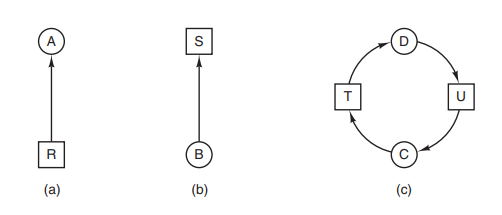

* 再看看使用**资源分配图**的方法。假设有三个进程（`A`，`B`，`C`）及三个资源（`R`，`S`，`T`）。三个进程对资源的请求和释放如下图 `a` 到 `c` 所示。操作系统可以随时选择任一非阻塞进程运行，所以它可选择 `A` 运行一直到 `A` 完成其所有工作，接着运行 `B`，最后运行 `C`。

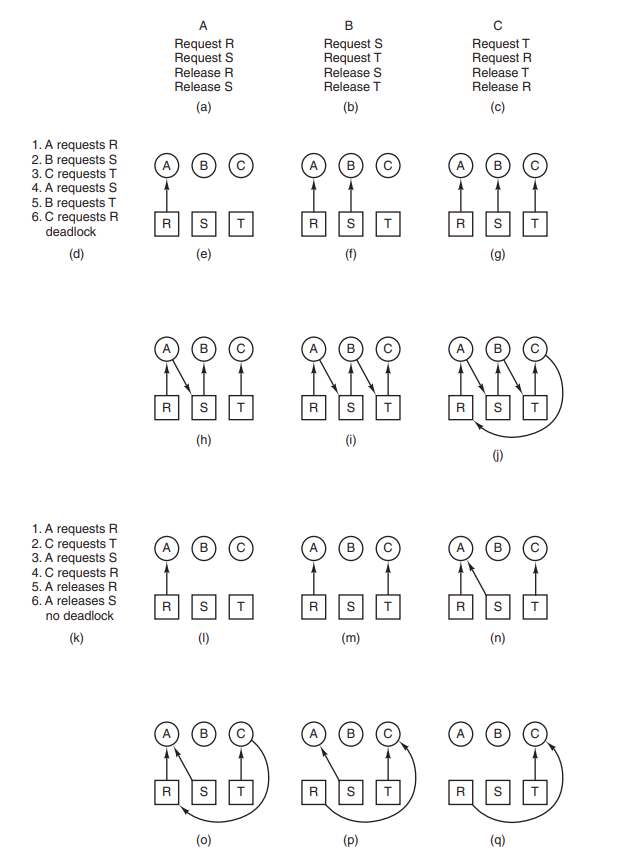

* 上述的执行次序不会引起死锁（因为没有资源的竞争），但程序也没有任何并行性。进程在执行过程中，不仅要请求和释放资源，还要做计算或者 `I/O` 工作。如果进程是串行运行，不会出现当一个进程等待 `I/O` 时让另一个进程占用 `CPU` 进行计算的情形。因此，严格的串行操作有可能不是最优的。

* 假设进程操作包含 `I/O` 和计算，那么轮转法是一种合适的调度算法。对资源请求的次序可能会如图 `d` 所示。假如按这个次序执行，图 `e～j` 是相应的资源分配图。在出现请求 4 后，如图 `h` 所示，进程 `A` 被阻塞等待 `S`，后续两步中的 `B` 和 `C` 也会被阻塞，结果如图 `j` 所示，产生环路并导致死锁。

* 不过正如前面所讨论的，并没有规定操作系统要按照某一特定的次序来运行这些进程。对于一个有可能引起死锁的资源请求，操作系统也可以不批准请求，并把该进程挂起（即不参与调度）一直到处于安全状态为止。比如上图中，操作系统可以不把资源 `S` 分配给 `B`，这样 `B` 被挂起。假如只运行进程 `A` 和 `C`，那么资源请求和释放的过程会如图 `k` 所示，这一过程的资源分配图在图 `l～q` 中给出，其中没有死锁产生。在第 `q` 步执行完后，就可以把资源 `S` 分配给 `B` 了，因为 `A` 已经完成，而且 `C` 获得了它所需要的所有资源。尽管 `B` 会因为请求 `T` 而等待，但是不会引起死锁，`B` 只需要等待 `C` 结束。

## 死锁处理

* **忽略死锁**（`ignoring deadlock`）：忽略死锁带来的影响。

  最简单的解决方法是[鸵鸟算法](https://en.wikipedia.org/wiki/Ostrich_algorithm)：把头埋到沙子里，假装根本没有问题发生。每个人对该方法的看法都不相同。数学家认为这种方法根本不能接受，不论代价有多大，都要彻底防止死锁的产生；工程师们想要了解死锁发生的频度、系统因各种原因崩溃的发生次数以及死锁的严重性。如果死锁平均每 5 年发生一次，而每个月系统都会因硬件故障、编译器错误或者操作系统故障而崩溃一次，那么大多数的工程师不会以性能损失和可用性的代价去防止死锁。

* **死锁检测和恢复**（`deadlock detection and recovery`）：没有规避死锁的发生，而是在检测到死锁发生后，采取措施进行恢复。

  1. **每种类型一个资源的死锁检测**

     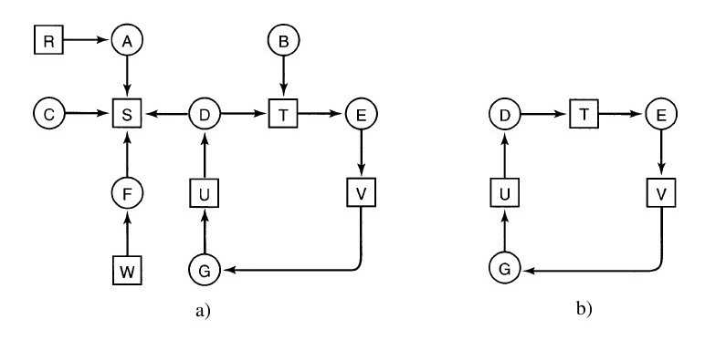

     可以对这样的系统构造一张资源分配图，如上图所示，如果包含了一个或一个以上的环，那么死锁就会存在。所以核心就是：**判断有向图中是否存在环**。（[拓扑排序](https://oi-wiki.org/graph/topo/)）

  2. **每种类型多个资源的死锁检测**

     * 提供一种基于矩阵的算法来检测死锁。假设资源的类型数为 `m`，`E` 表示**现有资源向量**，`Ei` 代表类型资源总数（`1≤i≤m`）， `A` 是**可用资源向量**，那么 `Ai` 表示当前可供使用的资源数（即没有被分配的资源）。另外有两个数组：`C` 代表**当前已分配矩阵**，`R` 代表**请求资源矩阵**。所以，`Cij` 代表进程 `i` 所持有的资源 `j` 的数量。同理，`Rij` 代表进程 `i` 还需要的资源 `j` 的数量。

       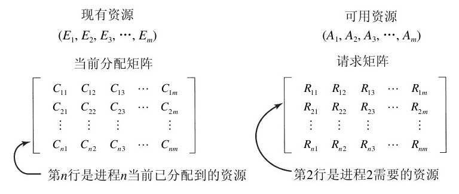

     * 这四种数据结构之间有一个重要的恒等式，即某种资源要么已被分配要么处于可用状态。

       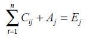
       
     * **死锁检测算法**如下：
       
       1. 寻找一个没有标记的进程 `Pi` ，对于它而言 `R` 矩阵的第 `i` 行向量小于或等于 `A`。
       2. 如果找到了这样一个进程，那么将 `C` 矩阵的第 `i` 行向量加到 `A` 中，标记该进程，并转到第 1 步。
       3. 如果没有这样的进程，那么算法终止。所有没有标记过的进程（如果存在的话）都是死锁进程。
     
  * 以下图为例：有 3 个进程、4 种资源（标记为磁带机、绘图仪、扫描仪和 `CD-ROM` 驱动器）。
    
       1. **首先找出哪一个进程的资源请求可被满足**。第 1 和 2 个不能被满足，因为没有 `CD-ROM` 驱动器或者扫描仪可用。第 3 个可被满足，所以进程 3 运行并最终释放它所拥有的资源。
       2. 给出 `A=(2 2 2 0)` 接下来，进程 2 也可运行并释放它所拥有的资源，给出 `A=(4 2 2 1)` 后剩下的进程都能够运行，所以这个系统中不存在死锁。假设情况有所改变。进程 2 需要 `(2 1 1 0)`。在这种情况下，所有的请求都不能得到满足，整个系统进入死锁。
       
       
       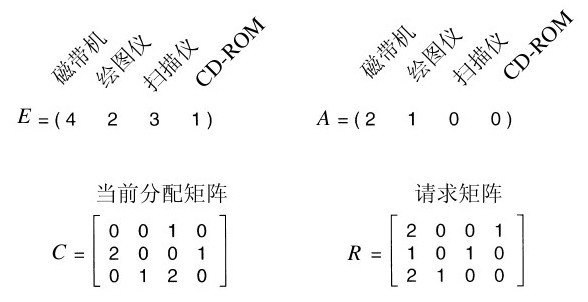

  3. **从死锁中恢复**

     * **利用抢占恢复**

       将部分死锁的进程挂起，并抢占它的资源，将这些资源分配给其它的死锁进程。但是应防止被挂起的进程长时间得不到资源而饥饿。

     * **利用回滚恢复**

       让一个或多个死锁进程回退到足以避免死锁的地步。这要求系统设计人员必须周期性地记录进程的历史信息，设置检查点。（**该检查点中不仅包括存储映像，还包括了资源状态，即哪些资源分配给了该进程。为了使这一过程更有效，新的检查点不应覆盖原有的文件，而应写到新文件中。这样，当进程执行时，将会有一系列的检查点文件被累积起来**）

     * **通过杀死进程恢复**

       最直接也是最简单的解决死锁的方法是杀死一个或若干个进程。但所付出的代价可能会很大，因为有些进程可能已经运行了很长时间，已经接近结束了，一旦被终止就功亏一篑了，还得从头再来。

* **死锁避免**（`deadlock avoidance`）：在资源的动态分配过程中，用某种方法去防止系统进入不安全状态。

  1. 安全状态和安全序列

     * 如果系统按照某种序列分配资源，可以使得每个进程都拿到资源并顺利完成，那么这样的序列就叫做**安全序列**。只要至少有一个安全序列，就可以认为系统处于**安全状态**。

       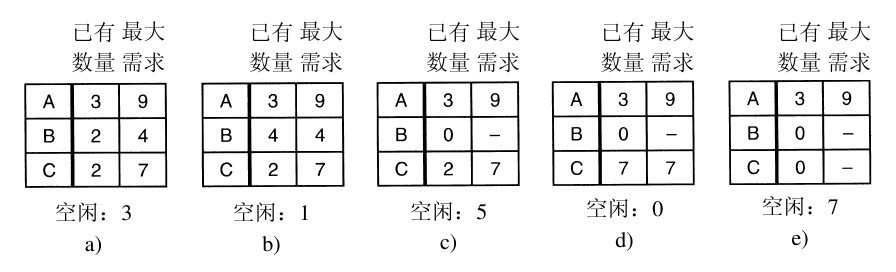

     * 反之，如果这样的序列一个都没有，那么就会有进程拿不到资源，进而无法顺利完成，此时就认为系统处于**不安全状态**。当系统处于不安全状态的时候，**有可能发生死锁**。

       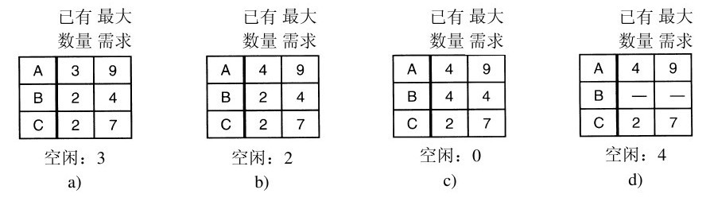

     * 虽然进入不安全状态，并不一定意味着会发生死锁，但是本着以防万一的想法，我们可以设法让系统永远不会进入不安全状态，从而从根源上避免死锁的发生。这样，我们的思路就**从避免死锁变成了避免不安全状态**。

  2. **银行家算法**（`Banker's Algorithm`）

     * 数据结构描述：

       1. **可利用资源向量 `Available`**：含有 `m` 个元素的数组，其中的每一个元素代表一类可利用资源数目。如果 `Available[j]=K`,则表示系统中现有 `Rj` 类资源 `K` 个。
       2. **最大需求矩阵 `Max`**：为 `n * m` 矩阵，定义了系统中 `n` 个进程中的每一个进程对 `m` 类资源的最大需求。如果 `Max[i,j]=K`，则表示进程 `i` 需要 `Rj` 类资源的最大数目为 `K` 。
       3. **分配矩阵 `Allocation`**：为 `n * m` 矩阵，定义了系统中每一类资源当前已分配给每一进程的资源数。如果 `Allocation[i,j]=K`，则表示进程 `i` 当前已分得 `Rj` 类资源的数目为 `K`。
       4. **需求矩阵 `Need`**：为 `n * m` 矩阵，表示每一个进程尚需的各类资源数。如果 `Need[i,j]=K`,则表示进程 `i` 还需要 `Rj` 类资源的数目为 `K`。
       5. 上述三个矩阵间存在下述关系：**`Need[i,j] = Max[i,j] - Allocation[i,j]`**。

     * 银行家算法描述：

       设 **`Requesti` 是进程 `Pi` 的请求向量**，如果 `Requesti［j］= K`，表示进程 `Pi` 需要 `K` 个 `Rj` 类型的资源。当 `Pi` 发出资源请求后，系统按下述步骤进行检查：

       1. 如果 `Requesti［j］≤ Need［i,j］`，便转向步骤 2；否则认为出错，因为它所需要的资源数大于它所宣布的最大值。

       2. 如果 `Requesti［j］≤ Available［j］`，便转向步骤 3；否则表示尚无足够资源，`Pi` 须等待。

       3. 系统试探着把资源分配给进程 `Pi`，并修改下面数据结构中的数值：

          ```c
          Available［j］= Available［j］- Requesti［j］;
          Allocation［i,j］= Allocation［i,j］+ Requesti［j］;   
          Need［i,j］= Need［i,j］- Requesti［j］;
          ```

       4. 系统执行安全性算法，检查此次资源分配后，系统是否处于安全状态。若安全，就正式将资源分配给进程 `Pi`，已完成本次分配；否则，取消这次的试探分配，恢复原来的资源分配状态，让进程 `Pi`等待。

     * 安全性算法描述：

       1. 初始时安全序列为空。
       2. 从 `Need` 矩阵中找出符合下面条件的行：该行对应的进程不在安全序列中且该行小于等于 `Available` 向量，找到后把对应的进程加入安全序列中；如果找不到，执行步骤 4。
       3. 进程 `Pi` 进入安全序列后，可顺序执行，直至完成，并释放出分配给它的资源，故应执行 `Available = Available + Allocation[i]`，其中 `Allocation[i]` 表示进程 `Pi` 代表的在 `Allocation` 矩阵中对应的行，返回步骤 2。
       4. 若安全序列已经包含所有的进程，则系统处于安全状态，否则处于不安全状态。

     * **安全性算法举例**：

       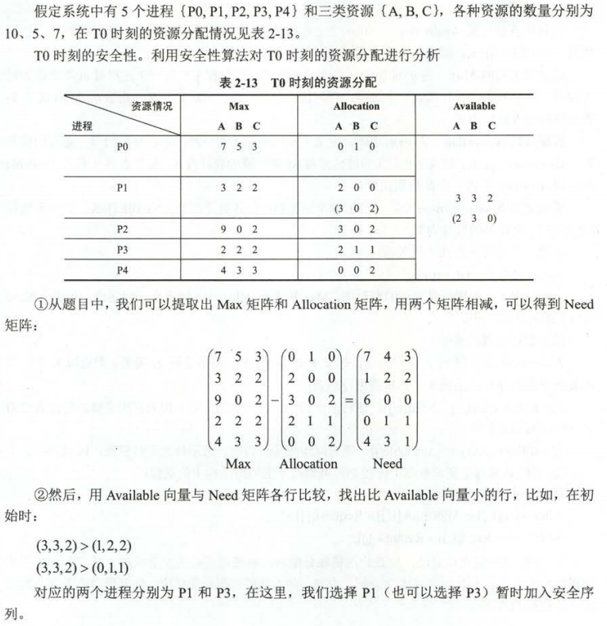

       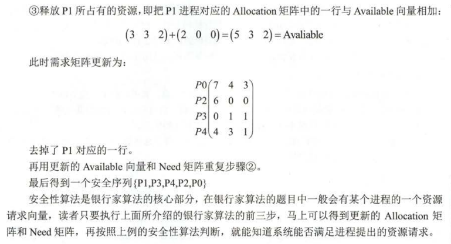

* **死锁预防**（`deadlock prevention`）：破坏死锁发生时的四个必要条件之一。
1. **破坏互斥条件**
  
   * 如果可以把某个互斥资源转化成共享资源，那么就不存在互相等待资源的情况了，也就不会发生死锁。借助**假脱机打印机技术**（`spooling printer`），可以把互斥资源在**逻辑**上转化为共享资源。
  
2. **破坏占有和等待条件**
  
     * 一种实现方法是规定所有进程**在开始执行前请求所需的全部资源，如果所需的全部资源可用，那么就将它们分配给这个进程**，于是该进程肯定能够运行结束。如果有一个或多个资源正被使用，那么就不进行分配，进程等待。
   * 另一种破坏占有和等待条件的略有不同的方案是，要求当一个进程请求资源时，先暂时释放其当前占用的所有资源，然后再尝试一次获得所需的全部资源。
  
3. **破坏不可抢占条件**
  
     * 从占有资源的进程的角度考虑，如果它请求不到新的资源，那么它必须立即释放占有的全部资源，以后需要的时候重新申请。
   * 从请求资源的进程的角度考虑，如果它需要请求资源，那么操作系统会帮助它**抢占相关资源**。比如现在有一个优先级更高的进程，如果是采用优先级调度算法，那么它将有机会在操作系统的帮助下抢占到资源。
  
4. **破坏循环等待条件**
  
   * 一种方法是保证每一个进程在任何时刻只能占用一个资源，如果要请求另外一个资源，它必须先释放第一个资源。但假若进程正在把一个大文件从磁带机上读入并送到打印机打印，那么这种限制是不可接受的。
   
   * 另一种避免出现环路等待的方法是将所有资源统一编号，进程可以在任何时刻提出资源请求，但是所有请求**必须按照资源编号的顺序**（升序）提出。比如下图：进程可以先请求打印机后请求磁带机，但不可以先请求绘图仪后请求打印机。
   
     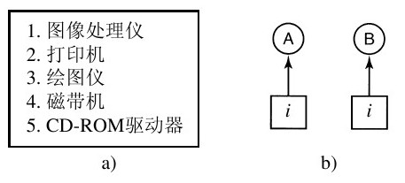
   
   * 若按此规则，资源分配图中肯定不会出现环。参看上图。只有在 `A` 请求资源 `j` 且 `B` 请求资源 `i` 的情况下会产生死锁。假设 `i` 和 `j` 是不同的资源，它们会具有不同的编号。若 `i＞j`，那么 `A` 不允许请求 `j`，因为这个编号小于 `A` 已有资源的编号；若 `i＜j`，那么 `B` 不允许请求 `i`，因为这个编号小于 `B` 已有资源的编号。不论哪种情况都不可能产生死锁。

## 相关

* **两阶段加锁**（`two-phase locking`，`2PL`）

  是数据库事务处理时的**并发控制**方法，以保证**可串行化**。在第一阶段，进程试图对所有所需的记录进行加锁，一次锁一个记录。如果第一阶段加锁成功，就开始第二阶段，完成更新然后释放锁。

* **通信死锁**（`communication deadlock`）

  1. 在通信系统中，即两个或两个以上进程利用发送信息来通信时。一种普遍的情形是进程 `A` 向进程 `B` 发送请求信息，然后阻塞直至 `B` 回复。假设请求信息丢失，`A` 将阻塞以等待回复，而 `B` 会阻塞等待一个向其发送命令的请求，因此发生死锁。
  2. 通常**超时**可以用来中断通信死锁，在大多数网络通信系统中，只要一个信息被发送至一个特定的地方，并等待其返回一个预期的回复，发送者就同时启动计时器。若计时器在回复到达前计时就停止了，则信息的发送者可以认定信息已经丢失，并重新发送（如果需要，则一直重复）。通过这种方式，可以避免死锁。

* **活锁**（`livelock`）

  1. 与死锁相似，死锁是进程都在等待对方先释放资源；活锁则是**进程彼此释放资源又同时占用对方释放的资源**。当此情况持续发生时，尽管资源的状态不断改变，但每个行程都无法获取所需资源，使得事情没有任何进展。
  2. 举例：假设两人正好面对面碰上对方。
     - 死锁：两人互不相让，都在等对方先让开。
     - 活锁：两人互相礼让，却恰巧站到同一侧，再次让开，又站到同一侧，同样的情况不断重复下去导致双方都无法通过。

* **饥饿**（`starvation`）

  在动态运行的系统中，在任何时刻都可能请求资源。这就需要一些策略来决定在什么时候谁获得什么资源。虽然这个策略表面上很有道理，但依然有可能使一些进程永远得不到服务，虽然它们并不是死锁进程。饥饿可以通过**先来先服务资源分配策略**来避免。

## 参考

* 《现代操作系统》第三版
* 《王道2019年操作系统考研复习指导》
* [Deadlock](https://en.wikipedia.org/wiki/Deadlock)
* [Banker's algorithm](https://en.wikipedia.org/wiki/Banker%27s_algorithm)
* [操作系统学习笔记-10：死锁](https://chorer.github.io/2020/04/21/OS-%E6%93%8D%E4%BD%9C%E7%B3%BB%E7%BB%9F%E5%AD%A6%E4%B9%A0%E7%AC%94%E8%AE%B0-10%EF%BC%9A%E6%AD%BB%E9%94%81/)