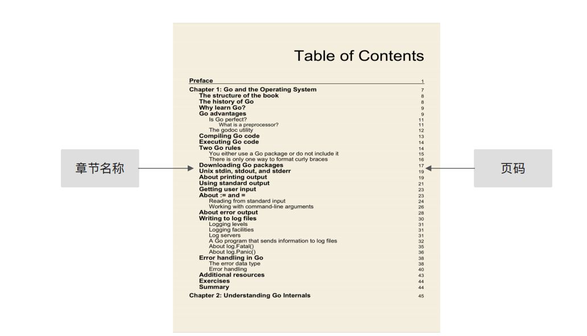
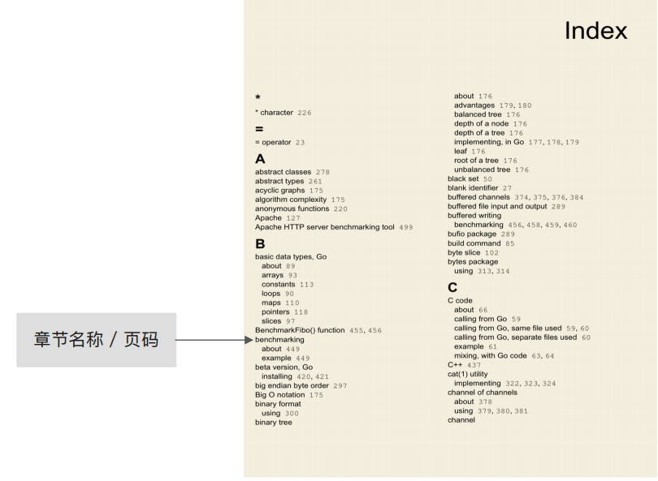
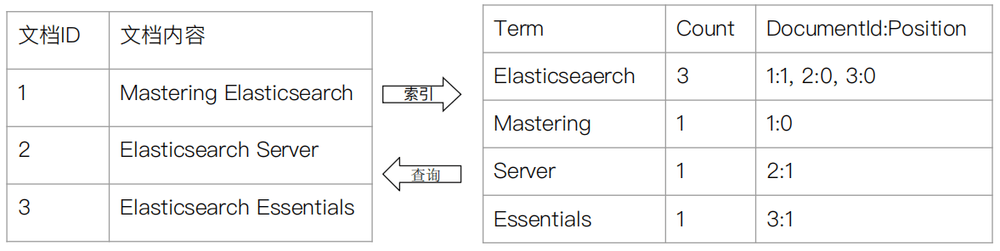
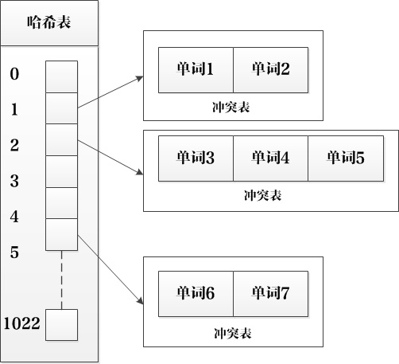
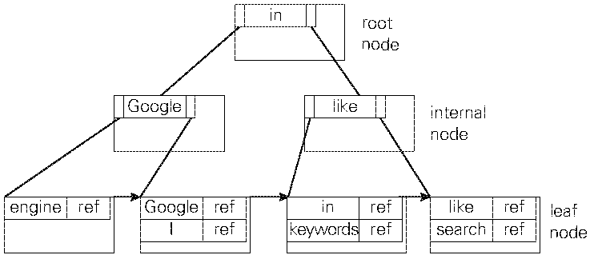
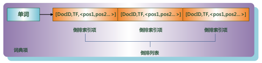
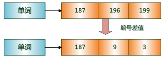
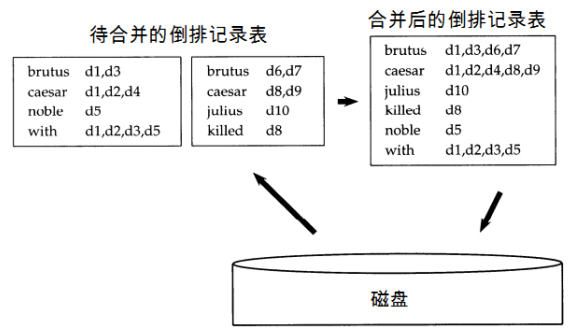

# 倒排索引

* 倒排索引（英语：Inverted index），也常被称为**反向索引**、**置入档案**或**反向档案**，是一种索引方法，被用来存储在全文搜索下某个单词在一个文档或者一组文档中的存储位置的映射。它是文档检索系统中最常用的数据结构。

* 有两种不同的反向索引形式：

  1. 一条记录的水平反向索引（或者反向档案索引）包含每个引用单词的文档的列表。

  2. 一个单词的水平反向索引（或者完全反向索引）又包含每个单词在一个文档中的位置。

  后者的形式提供了更多的兼容性（比如短语搜索），但是需要更多的时间和空间来创建。
  
## 区别

* **正排索引**：相当于图书中的**目录页**，在搜索引擎中，正向索引指的是**文档 ID 到文档内容和单词的关联**。

  

* **倒排索引**：相当于图书中的**索引页**，在搜索引擎中，倒排索引指的是是**单词到文档 ID 的关联**。

  
  
* **类比**

  比如下面左图有三篇文档，每篇文档的内容都是关于 `ElasticSearch` 的三本书将书中内容分成不同的关键词（Term），排在第一列，分别是 `ElasticSearch`，`Mastering`，`Server` 和 `Essentials`；第二列统计了关键词所出现的次数，比如 `ElasticSearch` 在内容中出现了三次；第三列标注的是文档 ID 和文档出现的位置，比如 `ElasticSearch` 在第 1,2,3 文档中都出现了，在第一个文档所处的位置是第二个，所以标注的为 1。
  
  
## 底层数据结构

* **单词词典**（Term Dictionary）

  单词词典是用来维护文档集合中出现过的所有单词的相关信息，同时用来记录某个单词对应的倒排列表在倒排文件中的位置信息。对于规模很大的文档集合来说，为了满足高效插入和查询的需要，一般采用哈希加链表和树形词典结构。

  1. **哈希加链表**

     

     * 由两个部分构成，主要部分是哈希表，每个哈希表项保存一个指针，指针指向冲突链表，在冲突链表里，相同哈希值的单词形成链表结构。之所以会有冲突链表，是因为两个不同单词获得相同的哈希值。
* 对于某个在文档中出现的单词 T，首先利用哈希函数获得其哈希值，之后根据哈希值对应的哈希表项读取其中保存的指针，就找到了对应的冲突链表。如果冲突链表里已经存在这个单词，说明单词在之前解析的文档里已经出现过；如果在冲突链表里没有发现这个单词说明该单词是首次碰到，则将其加入冲突链表里。通过这种方式，当文档集合内所有文档解析完毕时，响应的词典结构也就建立起来了。
     
2. **树形结构**
  
   
  
   * 比如上图是一个 B+ 树结构示意图。与哈希方式查找不同，需要字典项能够按照大小排序（数字或者字符序），而哈希方式则无须数据满足此项要求（以 `engine`、`Google`、`I`、`in`、`keyword`、`like`、`search` 这样字符排序）。最底层的叶子节点存储单词的地址信息，根据这个地址就可以提取出单词字符串。
  
* **倒排列表**（Posting List）

  倒排列表用来记录有哪些文档包括了某个单词。一般在文档集合里会有很多文档包含某个单词，每个文档会记录文档编号（DocID），单词在这个文档中出现的次数（TF）及单词在文档中哪些位置出现过等信息，这样与一个文档相关的信息被称作倒排索引项（Posting），包含这个单词的一系列倒排索引项形成了列表结构。

  

  * 在实际的搜索引擎系统中，并不存储倒排索引项中的实际文档编号，而是代之以文档编号差值（D-Gap）。文档编号差值是倒排列表中相邻的两个倒排索引项文档编号的差值，一般在索引构建过程中，可以保证倒排列表中后面出现的文档编号大于之前出现的文档编号，所以文档编号差值总是大于 0 的整数。如下图所示，原始的 3 个文档编号分别是 187、196 和 199，通过编号差值计算，在实际存储的时候就转化成了：187、9、3。

  

  * 之所以要对文档编号进行差值计算，主要原因是为了更好地对数据进行压缩，原始文档编号一般都是大数值，通过差值计算，就有效地将大数值转换为了小数值，而这有助于增加数据的压缩率。

## 如何构建倒排索引？

1. **基于块的排序索引方法**（BSBI: Blocked sort-based Indexing）

   基于磁盘的外部排序算法，此算法首先将词项映射成其 ID 的数据结构，如 Hash 映射。而后将文档解析成词项 ID—文档 ID对，并在内存中一直处理，直到累积至放满一个固定大小的块空间为止，我们选择合适的块大小，使之能方便加载到内存中并允许在内存中快速排序，快速排序后的块转换成倒排索引格式后写入磁盘。

   * 第 1 步，将文档集分割成几个大小相等的部分；

   * 第 2 步，将每个部分的词项 ID—文档 ID 对排序；

   * 第 3 步，将中间产生的临时排序结果存放到磁盘中；

   * 第 4 步，将所有的中间文件合并成最终的索引。

     ```c
     BSBI NDEXConSTRUCTION()
     n <- 0
     while(all documents have not been processed)
         do n<-n+1
             block <- PARSENEXTBLOCK()    // 文档分析
             BSBI-INVERT(block)
             WRITEBLOCKTODISK(block,fn)
     MERGEBLOCKS(f1,...,fn;fmerged)
     ```
     
* 上述算法实现的最后一步是：将 n 个块索引同时合并成一个索引文件。下图给出了将两个块进行合并的例子，其中 di 表示文档集中第 i 篇文档。合并时，同时打开所有块对应的文件， 内存中维护了为 n 个块准备的读缓冲区和一个为最终合并索引准备的写缓冲区。每次迭代中，利用优先级队列（即堆结构）或者类似的数据结构选择最小的未处理词项 ID 进行处理。读入该词项的倒排记录表并合并，合并结果写回磁盘中。需要时，再次从文件中读入数据到每个读缓冲区。
     
     
     
     * 由于该算法最主要的时间消耗在排序上（快排），因此其时间复杂度为 Θ（T log T），其中 T 是所需要排序的项数目的上界（即词项 ID—文档 ID 对的个数）。然而实际的索引构建时间往往取决于文档分析（PARSENEXTBLOCK）和最后合并（MERGEBLOCKS）的 时间。
   
   


2. **内存式单遍扫描索引方法**（SPIMI：Single-pass in-memory indexing）

   与上述 BSBI 算法不同的是：SPIMI 使用词项而不是其 ID，它将每个块的词典写入磁盘，对于下一个块则重新采用新的词典，只要硬盘空间足够大，它能索引任何大小的文档集。

   ```c
   SPIMI-Invert(Token_stream)
   output.file=NEWFILE()
   dictionary = NEWHASH()
   while (free memory available)
       do token <-next(token_stream)    // 逐一处理每个词项-文档ID对
           if term(token) !(- dictionary
              then postings_list = AddToDictionary(dictionary,term(token))
           else postings_list = GetPostingList(dictionary,term(token))
       if full(postings_list)
           then postings_list =DoublePostingList(dictionary,term(token))
       AddToPosTingsList (postings_list,docID(token))
   sorted_terms <- SortTerms(dictionary)
   WriteBlockToDisk(sorted_terms,dictionary,output_file)
   return output_file
   ```

   1. 算法逐一处理（程序第 5 行）每个词项—文档 ID 对。如果词项是第一次出现，那么将之加入词典，同时建立一个新的倒排记录表（程序第 7 行）；如果该词项不是第一次出现则直接返回其倒排记录表（程序第 8 行）。
   2. BSBI 和 SPIMI 的一个区别在于，后者直接在倒排记录表中增加一项（程序第 11 行）。和那种一开始就整理出所有的词项 ID—文档 ID 并对它们进行排序的做法不同，这里每个倒排记录表是动态增长的（也就是说，倒排记录表的大小会不断调整），同时立即就可以实现全体倒排记录表的收集。这样做有两个好处：**第一，由于不需要排序操作，因此处理的速度更快**；**第二，由于保留了倒排记录表对词项的归属关系，因此能够节省内存，词项 的 ID 也不需要保存**。这样，每次单独的 SPIMI-INVERT 调用能够处理的块大小可以非常大，整 个倒排索引的构建过程也因此会非常高效。
   3. 当内存耗尽时， 包括词典和倒排记录表的块索引将被写到磁盘上（程序第 13 行）。在这之前，为使倒排记录表按照词典顺序排序来加快最后的合并过程，要对词项进行排序操作（程序第 12 行）。如果每个块的倒排记录表没有事先排好序，那么合并过程很难通过一个简单的逐块扫描算法来实现。每次对 SPIMI-Inverter 的调用都会写一个块到磁盘，这和 BSBI 一样。SPIMI 最后一步就是将多个块合并成最后的倒排索引。
   4. 除对每个块建立新词典及去除高代价的排序操作之外，SPIMI 有一个重要的第三方组件：**压缩**。如果使用压缩技术，那么不论是倒排记录表还是词项都可以在磁盘上进行压缩存储。由于压缩一方面能使算法处理更大的块，另一方面能够使得原来的每个块所需要的磁盘空间更少，所以压缩技术能够进一步提高算法的效率。

3. **分布式索引构建方法**（Distributed indexing）

   * 实际当中，文档集通常都很大，在单台计算机上很难高效地构建索引，对 Web 构建规模合理的索引常常需要大规模的计算机集群。每台机器维护整个索引的一部分，有多台机器协作来完成索引的建立和对查询的响应。
   * 分布式索引构建方法是 `MapReduce` 的一个应用。`MapReduce` 是一个通用的分布式计算架构，它面向大规模计算机集群而设计。[Hadoop MapReduce](https://hadoop.apache.org/docs/r1.2.1/mapred_tutorial.html)

4. **动态索引构建方法**（Dynamic indexing）

   * 迄今为止，我们都假设文档集是静态的，这对于很少甚至永远不会改变的文档集来说没有任何问题。然而，大部分文档集会随文档的增加、删除或更新而不断改变。这也意味着需要将新的词项加入词典，并对已有词项的倒排记录表进行更新。
   * 如果要求能够及时检索到新文档，那么一种解决方法是同时保持两个索引：一个是大的主索引，另一个是小的用于存储新文档信息的**辅助索引**（auxiliary index），检索时可以同时遍历两个索引并将结果合并。文档的删除记录在一个**无效位向量**（invalidation bit vector）中，在返回结果之前可以利用它过滤掉已删除文档。
   * 由于动态索引构建的复杂性，一些大型搜索引擎采用从头开始重构索引而不是动态构建索引的方法。它们会周期性地构建一个全新的索引，然后将查询处理转到新索引上去，同时将旧索引删除。

## 参考

* 《这就是搜索引擎：核心技术详解》（张俊林 著）
* 《自制搜索引擎》（山田浩之, 末永匡 著，胡屹 译）
* 《信息检索导论》（Christopher D.Manning, Prabhakar Raghavan, Hinrich Schutze 著，王斌 译）（推荐）
* [Apache Lucene](https://lucene.apache.org/)
* [Index construction](https://nlp.stanford.edu/IR-book/html/htmledition/index-construction-1.html)
* [索引构建与索引压缩](http://home.ustc.edu.cn/~zhufengx/ir/pdf/IR-4_1_2015.pdf)
* [搜索引擎之倒排索引浅析](https://www.cnblogs.com/wupeixuan/p/12405554.html)