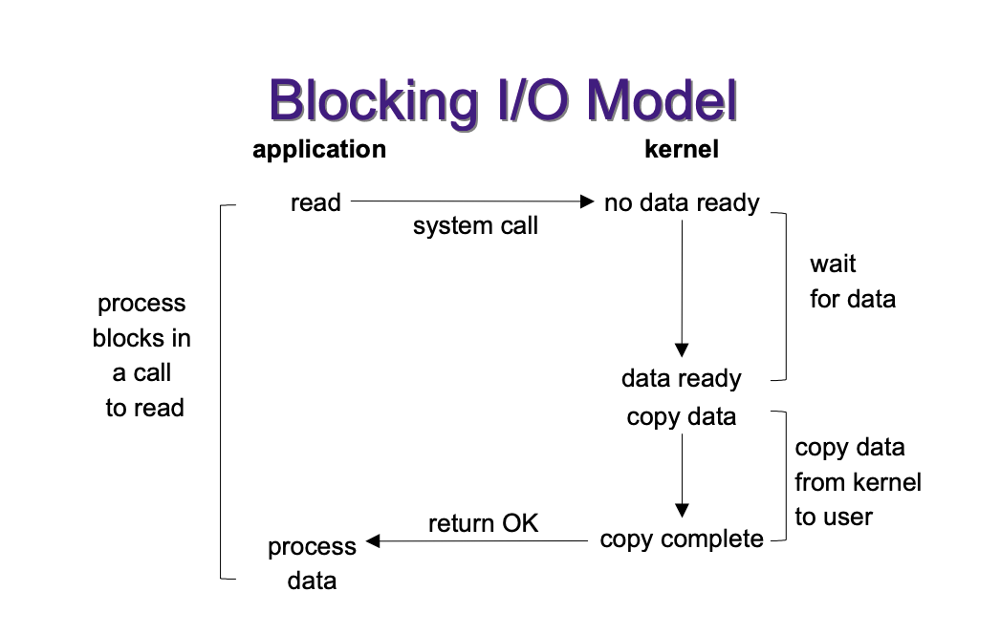
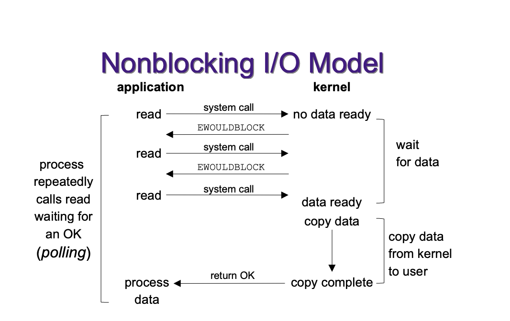
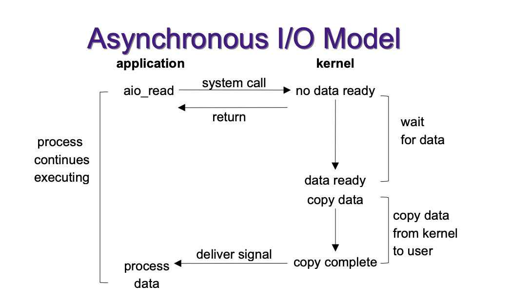
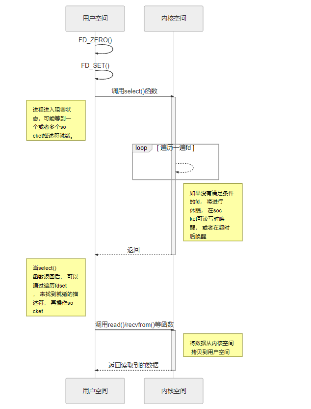
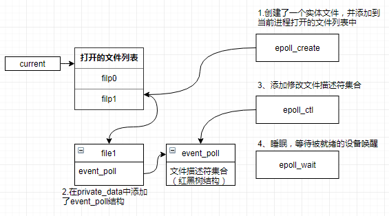
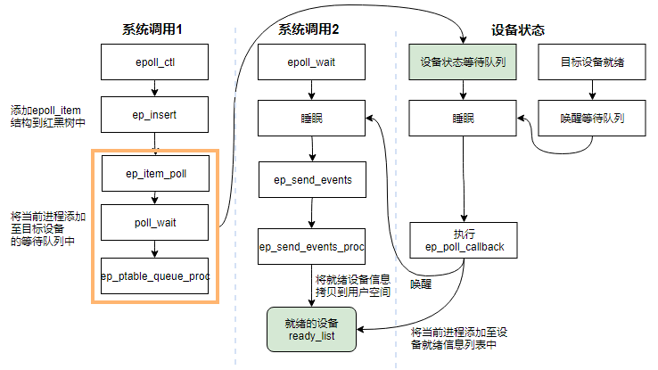

# I/O 多路复用

I/O 多路复用是指内核一旦发现进程指定的一个或者多个 I/O 条件准备就绪（也就是输入已准备好被读取，或者描述符已能承受更多的输出），它就通知该进程。

## I/O 模型

一个输入操作通常包括以下两个阶段：

1. 等待数据准备就绪。这涉及等待数据到达网络，当数据包到达时，它将被复制到内核的缓冲区中。
2. 将数据从内核复制到进程。意味着将就绪数据从内核缓冲区复制到应用程序缓冲区中。

#### Blocking I/O

  最流行的 I/O 模型是阻塞式 I/O 模型，默认情形下，所有的 `socket` 都是阻塞的。



#### Nonblocking I/O

  进程把一个 `socket` 设置成非阻塞是在告诉内核，当所请求的 I/O 操作非得使本进程进入睡眠状态才能完成时，不要使本进程进入睡眠状态，而是返回一个错误。

  

#### I/O Multiplexing

  将等待数据到来和读取实际数据两个事情分开，通过 `select` 等 I/O Multiplexing 的接口一次可以等待多个 `socket` 就绪。

  

#### Signal Driven I/O

  在描述符就绪时，内核通过发送 `SIGIO` 信号来通知。

  

#### Asynchronous I/O

  异步 I/O 由 `POSIX` 规范定义，告诉内核启动某个操作，并让内核在整个操作完成后进行通知。

  

####  同步 I/O vs 异步 I/O

* 同步 I/O 操作会导致请求进程阻塞，直到 I/O 操作完成。（阻塞 I/O、非阻塞 I/O、 I/O多路复用、信号驱动 I/O 四种模型都属于同步 I/O）
* 异步 I/O 操作不会导致请求进程阻塞。

## I/O 多路复用接口
#### Select 

`select` 机制会监听它所负责的所有 `socket`，当其中一个 `socket` 或者多个 `socket` 可读或者可写的时候，它就会返回，而如果所有的 `socket` 都是不可读或者不可写的时候，这个进程就会被阻塞，直到超时或者 `socket` 可读写，当 `select` 函数返回后，通过遍历 `fd` 集合，来找到就绪的 `fd`。

  

* 使用文档：[select(2) — Linux manual page](https://man7.org/linux/man-pages/man2/select.2.html)

* 接口函数如下：

  ```C
  #include <sys/select.h>
  #include <sys/time.h>
  
  int select(int nfds, fd_set *readfds, fd_set *writefds, fd_set *exceptfds, struct timeval *timeout);
  
  /* Returns: positive count of ready descriptors, 0 on timeout, –1 on error */
  
  // bitmap
  typedef struct {
      unsigned long fds_bits[__FDSET_LONGS];
  } fd_set;
  
  struct timeval  {
    long   tv_sec;          /* seconds */
    long   tv_usec;         /* microseconds */
  };
  ```

  `nfds` 是编号最大的 `fd` 加1，`readfds` 是监听读操作的 `fd` 列表，`writefds` 是监听写操作的 `fd` 列表，`exceptfds` 是监听出现异常的 `fd` 列表，`timeout` 是最大阻塞时间长度，配置的最小时间精度是毫秒。

* 优缺点：

  1. `select` 目前几乎在所有的平台上都支持，其良好跨平台支持也是它的一个优点。
  2.  单个进程能够监视的 `fd` 的数量存在最大限制，在 Linux 上一般为 1024，可以通过修改宏定义甚至重新编译内核的方式提升这一限制，但是这样也会造成效率的降低。
  3. 需要维护一个用来存放大量 `fd ` 的数据结构，这样会使得用户空间和内核空间在传递该结构时复制开销比较大。
  4. 每次在有 `socket` 描述符活跃的时候，都需要遍历一遍所有的 `fd` 找到该描述符，这会带来大量的时间消耗，时间复杂度是 O(n)。

#### Poll

`poll` 提供的功能和 `select` 类似，只是描述 `fd` 集合的方式不同， `poll` 使用 `pollfd` 结构而不是 `select` 的 `fd_set` 结构，不限制 `socket` 描述符的个数，因为 `poll` 是使用链表去维护。

* 使用文档：[poll(2) — Linux manual page](https://man7.org/linux/man-pages/man2/poll.2.html)

* 接口函数如下：

  ```C
  #include <poll.h>
  
  int poll (struct pollfd *fdarray, unsigned long nfds, int timeout);
  
  /* Returns: count of ready descriptors, 0 on timeout, –1 on error */
  
  struct pollfd {
    int     fd;            /* descriptor to check */
    short   events;        /* events of interest on fd */
    short   revents;       /* events that occurred on fd */
  };
  ```

  每个描述符有两个变量，`events` 是调用值，`reevents` 是结果值，从而避免值-结果参数。所以如果关注的 `events` 没有发生变化就可以重用 `fds`，因为 `poll` 只修改 `revents` 而不会改变 `events`。


* 优缺点：除了没有 `fd` 的限制，其他缺点和 `select` 一样，将 `fd` 集合从用户态拷贝到内核态开销大，轮询方式效率低。

#### Epoll

`epoll` 使用一个 `epfd` 管理多个 `socket` 描述符，且不限制 `socket` 描述符的个数， 将用户空间的 `socket` 描述符的事件存放到内核的一个事件表中 ，这样在用户空间和内核空间的拷贝只需一次。当 `epoll` 记录的 `socket` 产生就绪的时候，`epoll` 会通过回调的方式来激活这个 `fd`，这样 `epoll_wait` 便可以收到通知，告知应用层哪个 `socket` 已就绪。因此相比于 `select` 和 `poll` ，`epoll` 不需要遍历整个 `socket` 列表，所以时间复杂度是 O(1)。




* 使用文档：[epoll(7) — Linux manual page](https://man7.org/linux/man-pages/man7/epoll.7.html)

* 接口如下：

  ```C
  #include <sys/epoll.h>
  
  int epoll_create(int size);
  
  int epoll_ctl(int epfd, int op, int fd, struct epoll_event *event);
  
  int epoll_wait(int epfd, struct epoll_event * events, int maxevents, int timeout);
  
  typedef union epoll_data {
    void        *ptr;
    int          fd;
    uint32_t     u32;
    uint64_t     u64;
  } epoll_data_t;
  
  struct epoll_event {
    uint32_t     events;      /* Epoll events */
    epoll_data_t data;        /* User data variable */
  };
  ```

  **一颗红黑树，一张准备就绪句柄链表，少量的内核 `cache`**，就可以解决大并发下的 `socket` 处理问题，执行 `epoll_ create` 时，创建了红黑树和就绪链表；执行 `epoll_ ctl` 时，如果增加 `socket` 句柄，则检查在红黑树中是否存在，存在立即返回，不存在则添加到树干上，然后向内核注册回调函数，用于当中断事件来临时向准备就绪链表中插入数据；执行 `epoll_wait` 时立刻返回准备就绪链表里的数据即可。

* 优点：

  1. 支持一个进程打开大数目的 `socket` 描述符（一般来说这个数目和系统内存关系很大，具体数目可以通过 `cat /proc/sys/fs/file-max` 来察看）。
  2. I/O 效率不会随着 `socket` 描述符数目的增加而线性下降，因为只有活跃可用的 `socket` 描述符才会调用 `callback` 函数，与连接总数量无关。
  3. ~~使用 `mmap` 加速内核空间与用户空间的消息传递，减少复制开销。（[Memory Mapping](https://man7.org/linux/man-pages/man2/mmap.2.html)）~~（<font color=red>经查证资料，确认 epoll 在 Linux 内核中并未使用 mmap 来进行用户空间和内核空间的内存共享</font>）
  
* 缺点：

  1. `epoll_ctl` 是个系统调用，每次修改监听事件，增加监听描述符时都是一次系统调用，并且没有批量操作的方法。比如一口气要监听一万个描述符，要把一万个描述符从监听读改到监听写等就会很耗时，很低效。
  2. 对于服务器上大量连上又断开的连接处理效率低，即 `accept()` 执行后生成一个新的描述符需要执行 `epoll_ctl` 去注册新 `socket` 的监听，之后 `epoll_wait` 又是一次系统调用，如果 `socket` 立即断开了 `epoll_wait` 会立即返回，又需要再用 `epoll_ctl` 把它删掉。
  3. 依然有惊群问题，需要配合使用方式避免。

* LT 和 ET：

  1. 水平触发模式下，当 `epoll_wait` 检测到 `socket` 描述符处于就绪时就通知应用程序，应用程序可以不立即处理它。下次调用 `epoll_wait` 时，还会再次产生通知。
  2. 边缘触发模式下，当 `epoll_wait` 检测到 `socket` 描述符处于就绪时就通知应用程序，应用程序 **必须** 立即处理它。如果不处理，下次调用`epoll_wait` 时，不会再次产生通知。
  3. ET 模式在很大程度上减少了 `epoll` 事件被重复触发的次数，因此效率要比 LT 模式高 。但是 `epoll` 工作在 ET 模式的时候，必须要使用**非阻塞 I/O 模式**，以避免由于一个文件句柄的阻塞读/阻塞写操作把处理多个文件描述符的任务饿死。

* 拓展：[怎么解决惊群问题?](https://idea.popcount.org/2017-02-20-epoll-is-fundamentally-broken-12/)

* 应用：`Redis` 和 `Nginx`

## 其他

* `Kqueue`：[Kqueue: A generic and scalable event notification facility](https://people.freebsd.org/~jlemon/papers/kqueue.pdf)
*  `IOCP`：[I/O Completion Ports](https://docs.microsoft.com/en-us/windows/win32/fileio/i-o-completion-ports)

## 参考

* UNIX网络编程卷1：套接字联网API（第3版）
* [深入学习理解 IO 多路复用](https://juejin.im/post/6844904118054551559#heading-18)
* [Blocking I/O, Nonblocking I/O, And Epoll](https://eklitzke.org/blocking-io-nonblocking-io-and-epoll)