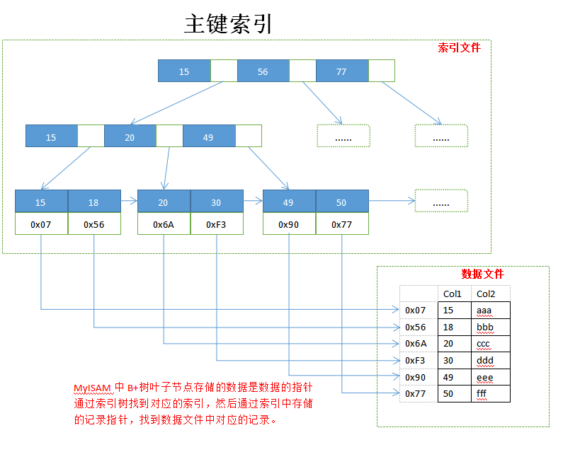
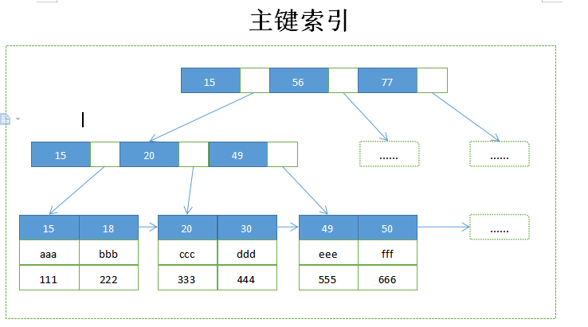
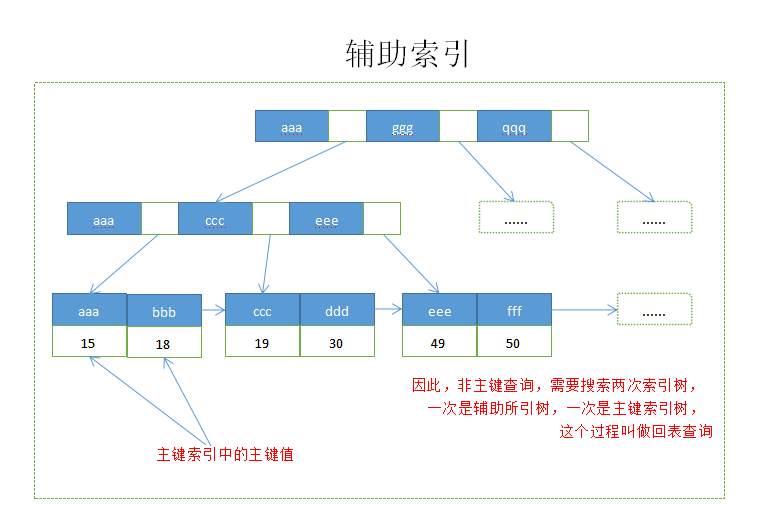

# 1. MyISAM索引

- 主键索引和辅助索引B+树叶⼦节点都只会存储数据⾏（数据⽂件）的指针。

## 1.1 主键索引

## 1.2 辅助索引

​	在 MyISAM 中,主键索引和辅助索引在结构上没有任何区别,只是主键索引要求 key 是唯⼀的,⽽辅助索引的 key 可以重复 。

# 2. InnoDB索引

- 主键索引的叶⼦节点会存储数据⾏，辅助索引的叶子节点只会存储主键值。
- InnoDB要求表必须有一个主键索引(MyISAM 可以没有)  

## 2.1 主键索引

可以看到InnoDB的主键索引的叶子节点存储了完整的数据记录。

## 2.2 辅助索引

与 MyISAM 索引的不同是 InnoDB 的辅助索引 data 域存储相应记录主键的值⽽不是地址指针。换句话说,InnoDB 的所有辅助索引都引⽤主键作为 data 域。  

索引这种实现⽅式使得按主键的搜索⼗分⾼效,但是使用辅助索引需要先获得主键,然后⽤主键到主键索引中检索获得记录 。

# 3. 索引原理引申

1.为什么不建议使⽤过⻓的字段作为主键?
		因为所有辅助索引都引⽤主键索引,主键长度越小，辅助的叶子节点就越小，辅助占用的空间也就越小。过⻓的主键索引会令辅助索引变得过⼤。同时,尽量在 InnoDB 上采⽤⾃增字段做表的主键 。

2.为什么建议使用组合索引？
		因为组合索引能够提高覆盖索引的命中率，减少回表查询，另外可以节省索引占用的存储空间。

3.为什么InnoDB支持行锁，而MyISAM则只支持表锁

InnoDB之所以支持行锁，是因为InnoDB的主键索引结构上，既存储了主键值，又直接存储了行数据，可以方便的锁住行数据，而MyISAM索引指向另一片数据文件，没有办法精确锁住数据段。进一步造成InnoDB支持事务，但是MyISAM不支持。

4.为什么索引不是越多越好？

索引需要占用额外的物理空间，除了数据表占数据空间之外，每一个索引还要占一定的物理空间，如果要建立组合索引那么需要的空间就会更大。写操作（`INSERT`/`UPDATE`/`DELETE`）时很可能需要更新索引，导致数据库的写操作性能降低。

5.联合索引最左前缀匹配原则

MySQL 会一直向右匹配直到遇到范围查询 `(>,<,BETWEEN,LIKE)` 不能进一步匹配了，后续退化为线性查找。因此，列的排列顺序决定了可命中索引的列数，需要将选择性高的列或基数大的列优先排在多列索引最前列。