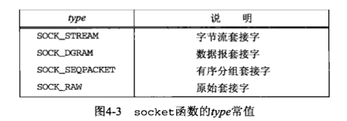
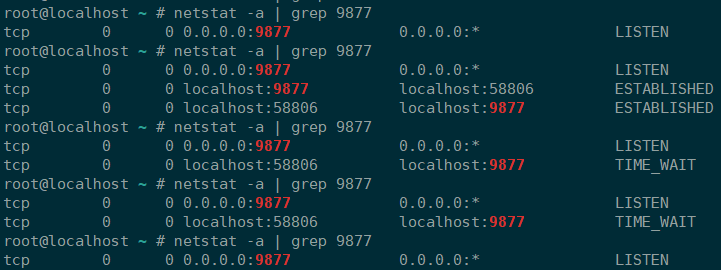

# Socket 编程

* `socket` 的原意是插座，在计算机通信领域，`socket` 被翻译为**套接字**，它是计算机之间进行通信的一种约定或一种方式。

* `socket` 起源于 `Unix`，而 `Unix/Linux` 基本哲学之一就是**一切皆文件**，都可以用打开 `open` –> 读写 `write/read` –> 关闭 `close` 模式来操作。

## 网络中进程间如何通信

* 首要解决的问题是如何唯一标识一个进程，在本地可以通过进程 `PID` 来唯一标识一个进程，但是在网络中这是行不通的。其实 `TCP/IP` 协议族已经帮忙解决了这个问题，网络层的 **`ip` 地址**可以唯一标识网络中的主机，而传输层的**协议 + 端口**可以唯一标识主机中的应用程序（进程）。这样利用三元组（`ip` 地址、协议、端口）就可以标识网络的进程了，网络中的进程通信就可以利用这个标志与其它进程进行交互。

  

## socket 地址结构

大多数套接字函数都需要一个指向套接字地址结构的指针作为参数。每个协议族都定义自己的套接字地址结构，这些结构的名字均以 `sockaddr_` 开头，并以对应每个协议族的唯一后缀结尾。

1. `IPv4` 套接字地址结构

   ```c
   struct in_addr {
       in_addr_t   s_addr;             /* normally uint32_t */
                                       /* network byte ordered */
   };
   
   struct sockaddr_in {
       uint8_t         sin_len;        /* length of structure (16) */
       sa_family_t     sin_family;     /* AF_INET, normally uint8_t */
       in_port_t       sin_port;       /* 16-bit TCP or UDP port number */
                                       /* network byte ordered */
       struct in_addr  sin_addr;       /* 32-bit IPv4 address */
                                       /* network byte ordered */
       char            sin_zero[8];    /* unused */
   };
   ```

2. `IPv6` 套接字地址结构

   ```c
   struct in6_addr {
       unit8_t     s6_addr[16]             /* 128-bit IPv6 address */
                                           /* network byte ordered */
   };
   
   /* required for compile-time tests */
   #deffine SIN6_LEN
   
   struct sockaddr_in6 {
       uint8_t             sin6_len;       /* length of this struct (28) */
       as_family_t         sin6_family;    /* AF_INET6 */
       in_port_t           sin6_port;      /* transport layer port */
       uint32_t            sin6_flowinfo;  /* flow information, undefined */
       struct in6_addr     sin6_addr;      /* IPv6 address */
                                           /* network byte ordered */
       uint32_t            sin6_scope_id   /* set of interfaces for a scope */
   };
   ```

3. 新的通用套接字地址结构

   ```c
   struct sockaddr_storage {
       uint8_t         ss_len;         /* length of this struct (implementation dependent) */
       sa_family_t     ss_family;      /* address family: AF_xxx value */
       /* implementation-dependent elements to provide:
        * a) alignment sufficient to fulfill the alignment requirements of
        *    all socket address types that the system supports.
        * b) enough storage to hold any type of socket address that the
        *    system supports.
        */
   };
   ```

4. 不同套接字地址结构的**比较**：上面介绍的分别对应下图中的第 1、2、5 列，第 3、4 列则是 `Unix` 域套接字和数据链路套接字。

   

5. `POSIX` 规范要求的数据类型

   | 数据类型    | 说明                                   | 头文件           |
   | ----------- | -------------------------------------- | ---------------- |
   | `int8_t`    | 带符号的 8 位整数                      | `<sys/types.h>`  |
   | `unit8_t`   | 无符号的 8 位整数                      | `<sys/types.h>`  |
   | `int16_t`   | 带符号的 16 位整数                     | `<sys/types.h>`  |
   | `uint16_t`  | 无符号的 16 位整数                     | `<sys/types.h>`  |
   | `int32_t`   | 带符号的 32 位整数                     | `<sys/types.h>`  |
   | `uint32_t`  | 无符号的 32 位整数                     | `<sys/types.h>`  |
   | `uint32_t`  | 套接字地址结构的地址族                 | `<sys/socket.h>` |
   | `in_addr_t` | `IPv4` 地址，一般为 `uint32_t`         | `<netinet/in.h>` |
   | `in_port_t` | `TCP` 或 `UDP` 端口，一般为 `uint16_t` | `<netinet/in.h>` |
## socket 的基本操作

既然 `socket` 是 `open` -> `write/read` -> `close` 模式的一种实现，那么 `socket` 就提供了这些操作对应的函数接口。下面以 `TCP` 为例，介绍一些基本的 `socket` 接口函数。


1. **`socket` 函数**

   为了执行网络 `I/O`，一个进程必须做的第一件事就是调用 `socket` 函数，指定期望的通信协议类型。

   ```c
   #include <sys/socket.h>
   
   int socket (int family, int type, int protocol);	// 返回：若成功则为非负描述符，若出错则为-1
   ```

   * 其中 `family` 参数指明协议族，`type` 参数指明套接字类型，`protocol` 参数指明协议类型，或者设为 0，以选择所给定 `family` 和 `type` 组合的系统默认值。

     

     

     

   * 并非所有套接字 `family` 与 `type` 的组合都是有效的，下图给出了一些真正有效的组合和对应的真正协议。

     

2. **`bind` 函数**

   `bind` 函数把一个本地协议地址赋予一个套接字。对于网际网协议，协议地址是 32 位的 `IPv4` 地址或 128 位的 `IPv6` 地址与 16 位的 `TCP` 或 `UDP` 端口号的组合。

   ```c
   #include <sys/socket.h>
   
   int bind (int sockfd, const struct sockaddr *myaddr, socklen_t addrlen);	// 返回：若成功则为0，若出错则为-1
   ```

   * 参数 `sockfd` 是 `socket` 函数返回的套接字描述符，`myaddr` 是一个指针，指向要绑定给 `sockfd` 的协议地址，`addrlen` 是该地址结构的长度。

   * 对于 `TCP`，调用 `bind` 函数可以指定一个端口号，或者指定一个 `IP` 地址，也可以两者都指定，还可以都不指定：

     1. 服务器在启动时捆绑它们的**众所周知端口**。

     2. 进程可以把一个特定的 `IP` 地址捆绑到它的套接字上，不过这个 `IP` 地址必须属于其所在主机的网络接口之一。

        

   * 通常服务器在启动的时候都会绑定一个众所周知的地址，用于提供服务，客户就可以通过它来接连服务器；而客户就不用指定，由系统自动分配一个端口号和自身的 `IP` 地址组合。这就是为什么通常服务器在 `listen()` 之前会调用 `bind` 函数 ，而客户就不会调用，而是在 `connect()` 时由系统随机生成一个。

3. **`listen` 函数**

   `listen` 函数仅由 `TCP` 服务器调用，当 `socket` 函数创建一个套接字时，它被假设为一个主动套接字，也就是说，它是一个将调用 `connect` 发起连接的客户套接字。`listen` 函数把一个未连接的套接字转换成一个被动套接字，指示内核应接受指向该套接字的连接请求。

   ```c
   #include <sys/socket.h>
   
   int listen (int sockfd, int backlog);	// 返回：若成功则为0，若出错则为-1 
   ```

   * 参数 `backlog` 规定了内核应该为相应套接字排队的最大连接个数，同时内核为任何一个给定的监听套接字维护两个队列：

     1. **未完成连接队列**（`incomplete connection queue`），已由某个客户发出并且发到服务器，而服务器正在等待完成相应的 `TCP` 三路握手过程。这些套接字处于 `SYN_RCVD` 状态。

     2. **已完成连接队列**（`completed connection queue`）,每个已完成 `TCP` 三路握手过程的客户对应其中的一项。这些套接字处于`ESTABLISHED` 状态。

        
        
     3. 每当在未完成连接队列中创建一项时，来自监听套接字的参数就复制到即将建立的连接中。连接的创建机制是完全自动的，无需服务器进程插手。
     
        

4. **`connect` 函数**

    `TCP` 客户用 `connect` 函数来建立与 `TCP` 服务器的连接，即激发 `TCP` 的三次握手过程。

    ```c
    #include<sys/socket.h>
    
    int connect(int sockfd,const struct sockaddr *servaddr,socklen_t addrlen);	// 返回：若成功则为0，若出错则为-1
    ```

    * `sockfd` 是由 `socket` 函数返回的套接字描述符，而第二个、第三个参数分别是一个指向套接字地址结构的指针和该结构的大小，套接字地址结构必须含有服务器的 `IP` 地址和端口号。

5. **`accept` 函数**

    `accept` 函数由 `TCP` 服务器调用，用于从已完成连接队列列头返回下一个已完成连接，如果已完成连接队列为空，进程将被投入睡眠（如果套接字为默认的阻塞方式）。

    ```c
    #include <sys/socket.h>
    
    int accept (int sockfd, struct sockaddr *cliaddr, socklen_t *addrlen);	// 返回：若成功为非负描述符，若出错则为-1
    ```

    * 参数 `cliaddr` 返回已连接的客户的协议地址，参数 `addrlen` 在函数调用的时候是传入的套接字地址结构的大小，函数返回时它的值是内核存放在该套接字地址结构中的确切字节数。
    * 第一个参数为**监听套接字**（`listening sicket`）描述符（由 `socket` 创建，随后用作 `bind` 和 `listen` 的第一个参数的描述符），称它的返回值为**已连接套接字**（`connected socket`）描述符。区分这两个套接字非常重要。一个服务器通常仅仅创建一个监听套接字，它在该服务器的生命周期内一直存在。内核为每个由服务器进程接受的客户连接创建一个已连接套接字（也就是说对于它的 `TCP` 三路握手过程已经完成）。当服务器完成对某个给定客户的服务时，相应的已连接套接字就被关闭。

6. **`fork` 函数**

    `fork` 函数（包括有些系统可能提供的它的各种变体）是 `Unix` 中派生新进程的唯一方法。

    ```c
    #include <unistd.h>
     
    pid_t fork(void);	// 返回：在子进程中为0，在父进程中为子进程的ID，若出错为-1
    ```

    * **调用一次，返回两次**。在调用进程（称为父进程）中返回一次，返回值是新派生进程（称为子进程）的进程 `ID` 号；在子进程又返回一次，返回值为 0。因此，返回值本身告知当前进程是子进程还是父进程。
    * `fork` 在子进程返回 0 而不是父进程的进程 `ID` 的原因在于：任何子进程只有一个父进程，而且子进程总是可以调用 `getppid` 取得父进程的`ID`。相反，父进程可以有许多子进程，而且无法获取各个子进程的进程 `ID`。如果父进程想要跟踪所有子进程的进程 `ID`，那么它必须记录每次调用 `fork` 的返回值。
    * 父进程中调用 `fork` 之前打开的所有描述符在 `fork` 返回之后由子进程分享。网络服务器利用了这个特性：父进程调用 `accpet` 之后调用 `fork`，所接受的已连接套接字随后就在父进程与子进程之间共享。通常情况下，子进程接着读写这个已连接套接字，父进程则关闭这个已连接套接字。
    * 有两种**典型用法**：
      1. 一个进程创建一个自身的副本，这样每个副本都可以在另一个副本执行其他任务的同时处理各自的某个操作。这是网络服务器的典型用法 。
      2. 一个进程想要执行另一个程序，该进程首先调用 `fork` 创建一个自身的副本，然后其中一个副本（通常为子进程）调用 `exec` 把自身替换成新的程序。这是诸如 `shell` 之类程序的典型用法。

7. **`exec` 函数**

    存放在硬盘上的可执行程序文件能够被 `Unix` 执行的唯一方法是：由一个现有进程调用 6 个 `exec` 函数中的某一个（这 6 个函数中是哪一个被调用并不重要时，它们统称为 `exec` 函数），`exec` 把当前进程映像替换成新的程序文件，而且该新程序通常从 `main` 函数开始执行。进程 `ID` 并不变。一般称调用 `exec` 的进程为调用进程，称新执行的程序为新程序。

    ```c
    #include <unistd.h>
     
    int execl (const char *pathname, const char *arg0, ... /* (char *) 0 */ );
     
    int execv (const char *pathname, char *const argv[]);
     
    int execle (const char *pathname, const char *arg0, ... /* (char *) 0, char *const envp[] */ );
     
    int execve (const char *pathname, char *const argv[], char *const envp[]);
     
    int execlp (const char *filename, const char *arg0, ... /* (char *) 0 */ );
     
    int execvp (const char *filename, char *const argv[]);	// 均返回：若成功则不返回，若出错则为-1
    ```

    * 6 个 `exec` 函数之间的**区别**在于：
      1. 待执行的程序是由文件名还是由路径名指定。
      2. 新程序的参数是一一列出还是由一个指针数组来引用。
      3. 把调用进程的环境传递给新程序还是给新程序所指定的新环境。

8. **`close` 函数**

    通常的 `Unix`， `close` 函数也用来关闭套接字，并终止 `TCP` 连接。

    ```c
    #include <unistd.h>
    
    int close (int sockfd);	// 返回：若成功则为0，若出错为-1
    ```

    * `close` 一个 `TCP` 套接字的默认行为是把该套接字设置成已关闭，然后立即返回到调用进程。该套接字描述符不能再由调用进程使用，也就是说它不能再作为 `read` 或 `write` 的第一个参数。然而 `TCP` 将尝试发送已排队等待发送到对端的任何数据，发送完毕后发生的是正常的 `TCP` 连接终止序列。
    * 在并发服务器中，`fork` 一个子进程会复制父进程在 `fork` 之前创建的所有描述符，复制完成后相应描述符的引用计数会增加 1，调用 `close` 会使描述符的引用计数减 1，一旦描述符的引用计数为 0，内核就会关闭该套接字；如果描述符的引用计数仍然大于 0 的话，就不会引发 `TCP` 的终止序列。如果想在一个 `TCP` 连接上发送 `FIN` 可以调用 `shutdown` 函数。

## 示例

使用前面介绍的基本函数实现一个简单的 `TCP` 客户/服务器程序实例，这个程序是执行以下步骤的一个回射服务器：

* 客户从标准输入读入一行文本，并写给服务器。

* 服务器从网络输入读取这行文本，并回射给客户。

* 客户从网络输入读入这行回射文本，并显示在标准输出上。

  

* `unp` 环境搭建

  ```c
  wget http://www.unpbook.com/unpv13e.tar.gz
  
  tar -zxvf unpv13e.tar.gz
  
  cd unpv13e
  ./configure
  
  cd lib
  make
  
  cd ../libfree
  make				// 执行这一步的时候会报错，将libfree下的inet_ntop.c文件的第60行由`size_t size`改为`socklen_t size`即可
  
  vim ../lib/unp.h	// 修改：将#include “../config.h”修改为#include “config.h”
  ：wq
  
  cd ..
  cp libunp.a /usr/lib/
  cp libunp.a /usr/lib64/
  
  cp config.h   /usr/local/include/
  cp lib/unp.h  /usr/local/include/
  ```

* 编译测试（以 `tcpserv01.c` 和 `tcpcli01.c` 为例）

  ```c
  gcc tcpserv01.c -o tcpserv01 -lunp	// 编译tcpserv01.c，编译时必须加上静态链接库：-l参数加上libunp.a，去掉lib和后面的.a得到参数-lunp
  
  gcc tcpcli01.c -o tcpcli01 -lunp	// 编译tcpcli01.c
  
  ./tcpserv01 &						// 后台启动服务器
      
  ./tcpcli01 127.0.0.1				// 同一台主机上启动客户
  
  netstat -a | grep 9877				// 端口监听
  ```

* 效果图显示

  1. 后台启动服务器（加上 `&`），并查看 9877 端口状态为 `LISTEN`。

     

  2. 同一主机启动客户，并发送服务器 `hello world`，同时收到服务器返回的相同字符。

     

  3. 此时的 9877 端口状态变化为 `ESTABLISHED`。

     

  4. 客户键入 `EOF` 字符（`ctrl`+`D`）终止连接。

     

  5. 此时 9877 端口状态先是持续 `TIME_WAIT`，然后变回为 `LISTEN`。

     

  6. 最后查看进程信息，有一个父进程和僵尸进程（带 `defunct`），记得 `kill` 掉。`tcpserv02` 等优化版本可通过**信号机制调用 `wait` 函数来处理僵尸进程**。

     
## 参考

* 《UNIX网络编程 卷1：套接字联网API》（第3版）
* [UNIX Network Programming Source Code](http://www.unpbook.com/src.html)
* [TCP Client/Server Example](https://notes.shichao.io/unp/ch5/)
* [Linux Socket编程（不限Linux）](https://www.cnblogs.com/skynet/archive/2010/12/12/1903949.html)
* [Unix网络编程第一卷-3环境配置](https://www.jianshu.com/p/9ea46485bd91)
* [TCP回射客户-服务器程序](https://cloud.tencent.com/developer/article/1356202)