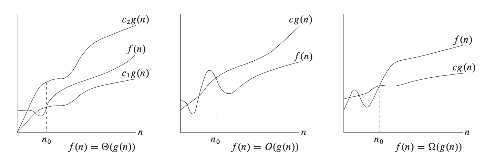
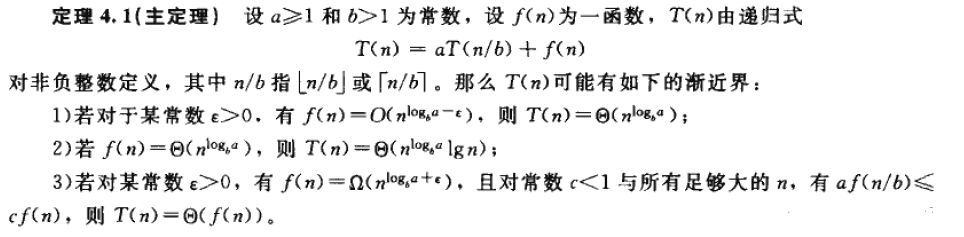

# 时间复杂度
* 维基百科：在计算机科学中，算法的**时间复杂度**（Time complexity）是一个函数，它定性描述该算法的运行时间。这是一个代表算法输入值的字符串的长度的函数。时间复杂度常用大  $O$ 符号表述，不包括这个函数的低阶项和首项系数。使用这种方式时，时间复杂度可被称为是渐近的，亦即考察输入值大小趋近无穷时的情况。

## 什么是大 $O$ ？
* 算法导论给出的解释：**大 $O$ 用来表示上界的**，当用它作为算法的最坏情况运行时间的上界，就是对任意数据输入的运行时间的上界。
  ```Cpp
  INSERTION_SORT(A)
    for j = 2 to A.length
    key = A[j]
      i = j - 1
      while i > 0 and A[i] > key
        A[i+1] = A[i]
        i = i - 1
      A[i+1] = key
  ```
  ​        比如上面**插入排序**算法的双重嵌套循环结构对最坏情况运行时间立即产生一个 $O$($n^2$) 的上界，内层循环每次迭代的代价以 $O(1)$ 为上界，下标 $i$ 和 $j$ 均最多为 $n$，对于 $n^2$ 个 $i$ 和 $j$ 值对的每一对，内循环最多执行一次。
  
## 为什么要关注最坏情况？
1. 一个算法的最坏情况下的运行时间给出了任何输入的运行时间的一个上界。知道了这个界，就能确保该算法绝不需要更长的时间。我们不必对运行时间做某种复杂的猜测并可以期望它不会变得更坏。

2. 对于某些算法，最坏情况经常出现，例如，当在数据库中检索一条特定信息时，若该信息不在数据库中出现，则检索算法的最坏情况会经常出现。在某些应用中，对缺失信息的检索可能是频繁的。

3. 虽然最坏情况是一种悲观估计，但是对于很多问题，平均情况和最坏情况下的运行时间其实差不多的，比如插入排序算法，平均情况和最坏情况下的运行时间都是输入规模的一个二次函数。

## 分析与计算方式
* **次数最多原则**
  
  ```Cpp
  int sumFunc(int n) {
    int sum = 0;  // 执行1次，忽略不计
    for (int i = 0; i < n; i++) {
      sum += i;  // 循环内执行次数最多，执行次数为n次，因此时间复杂度记为O(n)
    }  
    return sum;  // 执行1次，忽略不计
  }
  ```
  ​        当 $n$ 变得越来越大时，常量、低次幂和最高次幂的系数三部分影响不了其增长趋势，可以直接忽略它们，**只需要关注循环次数最多的那部分即可**。
  
* **加法原则**
  ```Cpp
  int sumFunc(int n) {
    int sum = 0;  // 常量级，忽略
      for (int i = 0; i < 99; i++) {
      sum += i;  // 执行100次，还是常量级，忽略
    }
      
    for (int i = 0; i < n; i++) {
      sum += i;  // 执行n次
    }
      
    for (int i = 0; i < n; i++) {
      for (int j = 0; j < n; j++) {
        sum += i;  // 执行n*n次
      }
    }
    return sum;  // 常量级，忽略
  }
  ```
  ​       最大的两块代码时间复杂度分别为 $O(n)$ 和 $O(n^2)$，取其中最大的数量级，时间复杂度为 $O(n^2)$，**量级最大的那段代码时间复杂度 = 总的时间复杂度**。

* **乘法原则**
  
  ```Cpp
  void Func1(int n) {
    for (int i = 0; i < n; i++) {
      Func2(n);  // 执行n次，每次都会调用Func2函数执行n次
    }
  }
  
  void Func2(int n) {
    int sum = 0;
    for (int i = 0; i < n; i++) {
      sum += 1;  // 执行n次
    }
  }
  ```
  ​       $Func1$ 每执行一次都会调用 $Func2$ 一次，所以时间复杂度为 $O(n) * O(n) = O(n^2)$，**嵌套代码的复杂度等于嵌套内外代码复杂度的乘积**。

## 常见的几种复杂度

|    名称    |      数量级      | 能承受的大致规模 |      常见算法      |
| :--------: | :--------------: | :--------------: | :----------------: |
|   常数阶   |      $O(1)$      |       任意       |    直接输出结果    |
|   对数阶   |   $O(log N)$   |       任意       |  二分查找、快速幂  |
|   线性阶   |     $O(N)$     |     以百万计     |     贪心、遍历     |
| 线性对数阶 | $O(N*log N)$ |     以百万计     | 带有分治思想的算法 |
|   平方阶   |    $O(N^2)$    |      以千计      |   枚举、动态规划   |
|   指数阶   |    $O(2^N)$    |       $24$       |        搜索        |
|   阶乘阶   |    $O(N!)$    |       $10$       |       全排列       |

* 所耗费的时间从小到大依次是：
  ​                                        $O(1)$  <  $O(log N)$  <  $O(N)$  <  $O(N*log N)$  <  $O(N^2)$  <  $O(2^N)$  <  $O(N!)$  <  $O(N^N)$

## 渐进记号


### $\Theta$ 记号
* $\Theta$ 记号渐进地给出一个函数的上界和下界。
* 定义：若存在正常量 $c_1$、$c_2$ 和 $n_0$，使得对所有 $n \geq n_0$，有 $0 \leq c_1g(n) \leq f(n) \leq c_2g(n)$。

### $O$ 记号
* $O$ 记号给出一个函数的渐进上界。
* 定义：若存在正常量 $c$ 和 $n_0$，使得对所有 $n \geq n_0$，有 $0 \leq f(n) \leq cg(n)$。

### $\Omega$ 记号
* $\Omega$ 记号提供了一个函数的渐进下界。
* 定义：若存在正常量 $c$ 和 $n_0$，使得对所有 $n \geq n_0$，有 $0 \leq cg(n) \leq f(n)$。

### $o$ 记号和 $\omega$ 记号
* 另外还有 $o$ 记号和 $\omega$ 记号，分别表示一个非渐进精确的上界和非渐进精确的下界。

### 记忆小秘诀
- $\Theta$ 的含义和 “等于” 类似。
- $O$ 的含义和 “小于或等于” 类似。
- $\Omega$ 的含义和 “大于或等于” 类似。
- $o$ 的含义和 “小于” 类似。
- $\omega$ 的含义和 “大于” 类似。

## 分治策略与递归式
在分治策略中，可以递归地求解一个问题，在每层递归中应用以下三个步骤：

1. 分解（Divide）：将问题划分为一些子问题，子问题的形式与原问题一样，只是规模更小。

2. 解决（Conquer）：递归地求解子问题，如果子问题的规模足够小，则停止递归，直接求解。

3. 合并（Combine）：将子问题的解合并成原问题的解。

​       递归式与分治法是紧密相连的，因为使用递归式可以很自然地刻画分治算法的运行时间。如果要描述分治与递归的关系，可以这样回答：**分治依托于递归，分治是一种思想，而递归是一种手段，递归式可以刻画分治算法的时间复杂度**。

###  求解递归式
* **代入法**
  
  1. 定义：猜测一个界，然后用数学归纳法证明这个界是正确的。
  
  2. 总结：这种方法只能用于解的形式很容易猜的情形，而且还需要一定经验的积累，才可以通过转换为先前见过的类似递归式来求解。 

* **递归树法**
  1. 定义：将递归式转化为一棵树，其结点表示不同层次的递归调用产生的代价，然后采用边界和技术来求解递归式。

  2. 分析：**将递归树中每一层内的代价求和，得到一个每层代价的集合，然后将所有层的代价再求和，得到所有层次的递归调用的总代价**。

  3. 总结：递归树最适合用来生成好的猜测，然后即可用代入法来验证猜测是否正确。

* **主方法**
  1. 定义：可求解形如下面公式的递归式的界：

     ​                                       $T(n) = aT(n/b) + f(n)$      (其中 $a \geq 1,b > 1$)

     ​        这种形式的递归式很常见，它刻画了这样一个分治算法：**生成 $a$ 个子问题，每个子问题的规模是原问题规模的 $1/b$，分解和合并步骤总共花费时间为 $f(n)$**。

  2. 总结： 主方法是最好用的方法，书本上以 ”菜谱“ 来描述这种方法的好用之处，它可以瞬间估计一个递推式的算法复杂度，主方法依赖于下面的**主定理**。
  
     